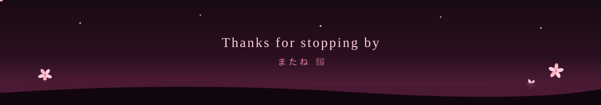

<div align="center">
  
</div>

<div align="center">
  
</div>

<br/>

```yaml
name:      Muchammad Fatkhul Karim (Luminova)
role:      Full-stack Web Developer
location:  Indonesia
currently: building clean, interactive web apps & learning something new
```

> 🌸 I care about readable code, thoughtful UX, and shipping things that feel good to use. Let's build something amazing together!

<div align="center">
  
</div>

## 💻 Tech Stack & Tools

<div align="center">
  <a href="https://skillicons.dev">
    
  </a>
</div>

<div align="center">
  
</div>

## 📊 GitHub Metrics

<div align="center">
  <table>
    <tr>
      <td valign="top">
        
      </td>
      <td valign="top">
        
      </td>
    </tr>
    <tr>
      <td colspan="2" align="center">
        
      </td>
    </tr>
  </table>
</div>

<div align="center">
  
</div>

<div align="center">
  
</div>

<div align="center">
  
</div>

## 🌸 Connect

<div align="center">
  <a href="https://linkedin.com/in/muchammad-fatkhul-karim-931710295">
    
  </a>
  <a href="https://instagram.com/fatkhulkariiim">
    
  </a>
  <a href="https://x.com/karim_064">
    
  </a>
</div>

<br/>

<div align="center">
  
</div>

<div align="center">
  
</div>

<div align="center">
  
</div>
